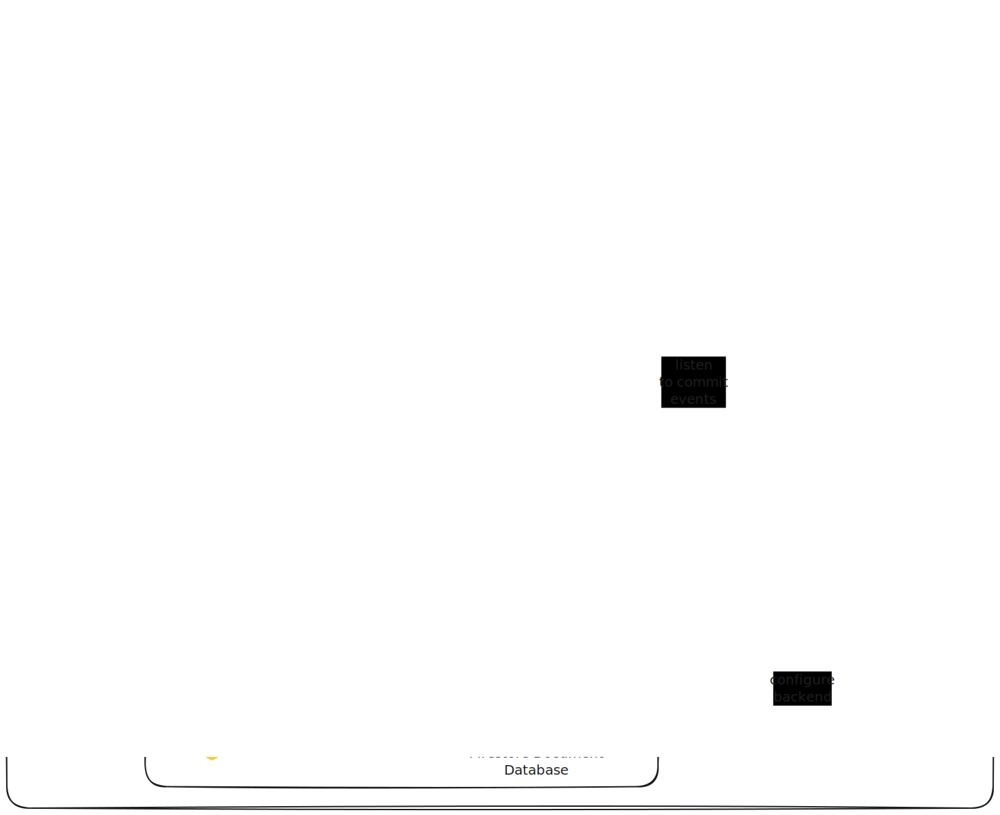

# Bad-Bank Project

## Project Overview
Bad-Bank is a React-based banking application using Firebase for backend services and Vercel for frontend hosting.



## Prerequisites
- Node.js and npm installed
- Git installed
- Firebase account
- Vercel account

## Setup Process

### 1. Clone the Repository
```bash
git clone https://github.com/your-username/bad-bank.git
cd bad-bank
```

### 2. Install Dependencies
```bash
npm install
```

### 3. Set Up Firebase

a. Install Firebase CLI:
```bash
npm install -g firebase-tools
```

b. Login to Firebase:
```bash
npx firebase login
```

c. Initialize Firebase in your project:
```bash
npx firebase init
```
- Select Firestore and Storage
- Choose an existing project or create a new one
- Use default options for Firestore and Storage setup

d. Activate Authentication in Firebase Console:
- Go to [Firebase Console](https://console.firebase.google.com/)
- Select your project
- Navigate to "Authentication" > "Sign-in method"
- Enable desired sign-in methods (e.g., Email/Password)

e. Activate Storage in Firebase Console:
- In Firebase Console, go to "Storage"
- Click "Get Started" and follow the prompts

f. Obtain Firebase Configuration:
- In Firebase Console, go to Project Settings
- Under "Your apps", click the Web app icon (`</>`)
- Register app if not done already
- Copy the `firebaseConfig` object

### 4. Set Up Vercel

a. Install Vercel CLI:
```bash
npm install -g vercel
```

b. Login to Vercel:
```bash
npx vercel login
```

c. Initialize Vercel in your project:
```bash
npx vercel
```
Follow the prompts to link your project to Vercel.

d. Set Environment Variables in Vercel:
- Go to [Vercel Dashboard](https://vercel.com/dashboard)
- Select your project > Settings > Environment Variables
- Add the following variables with values from your Firebase config:
  - REACT_APP_FIREBASE_API_KEY
  - REACT_APP_FIREBASE_AUTH_DOMAIN
  - REACT_APP_FIREBASE_PROJECT_ID
  - REACT_APP_FIREBASE_STORAGE_BUCKET
  - REACT_APP_FIREBASE_MESSAGING_SENDER_ID
  - REACT_APP_FIREBASE_APP_ID

### 5. Local Development

a. Create a `.env` file in the project root:
```
REACT_APP_FIREBASE_API_KEY=your_api_key
REACT_APP_FIREBASE_AUTH_DOMAIN=your_auth_domain
REACT_APP_FIREBASE_PROJECT_ID=your_project_id
REACT_APP_FIREBASE_STORAGE_BUCKET=your_storage_bucket
REACT_APP_FIREBASE_MESSAGING_SENDER_ID=your_messaging_sender_id
REACT_APP_FIREBASE_APP_ID=your_app_id
```

b. Start the development server:
```bash
npm start
```

### 6. Deployment to Vercel

a. Push your changes to GitHub:
```bash
git add .
git commit -m "Ready for deployment"
git push
```

b. Deploy to Vercel:
```bash
npx vercel --prod
```

c. Add Vercel domain to Firebase:
- Go to Firebase Console > Authentication > Settings > Authorized domains
- Add your Vercel domain (e.g., `your-app.vercel.app`)

### 7. Troubleshooting

- Clear browser cache and cookies if you encounter unexpected behavior
- Check Vercel deployment logs for any build errors
- Verify all environment variables are correctly set in Vercel
- Ensure Firebase services (Auth, Firestore, Storage) are properly initialized in your code

## Contributing

Please read [CONTRIBUTING.md](CONTRIBUTING.md) for details on our code of conduct and the process for submitting pull requests.

## License

This project is licensed under the MIT License - see the [LICENSE.md](LICENSE.md) file for details.